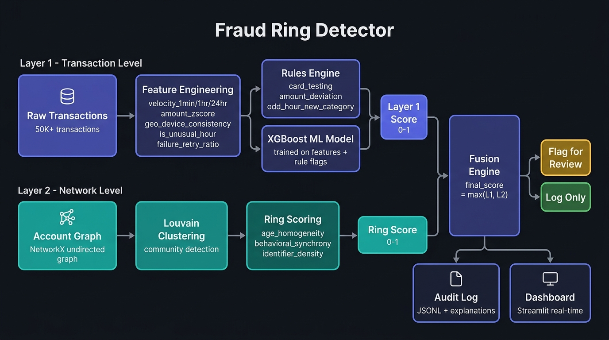

# Fraud Ring Detector — Architecture

## System Overview



## Pipeline Stages

### Layer 1: Transaction-Level Analytics

| Stage | Module | Purpose |
|---|---|---|
| **Data Generation** | `src/generate_data.py` | Generates 2,000 accounts and 50,000+ synthetic transactions with embedded fraud patterns and abuse rings |
| **Feature Engineering** | `src/layer1/features.py` | Extracts rolling-window features per account: velocity (1min/1hr/24hr), amount z-score, geo/device consistency, unusual hour detection, failure-retry ratio |
| **Rules Engine** | `src/layer1/rules.py` | Heuristic rules for known attack patterns: card testing, amount deviation + new device, odd-hour + new merchant category |
| **ML Model** | `src/layer1/model.py` | XGBoost classifier trained on engineered features + rule flags. Outputs calibrated probability scores (0–1) |

### Layer 2: Network Analytics

| Stage | Module | Purpose |
|---|---|---|
| **Graph Construction** | `src/layer2/graph.py` | Builds an undirected NetworkX graph. Nodes = accounts, edges = shared device IDs, /24 IP subnets, payment instruments, or registration time proximity |
| **Community Detection** | `src/layer2/clustering.py` | Runs Louvain algorithm on large connected components to split them into tight sub-clusters |
| **Ring Scoring** | `src/layer2/scoring.py` | Scores each cluster on: account age homogeneity, behavioral synchrony (hourly activity correlation), and shared identifier density |

### Fusion & Output

| Stage | Module | Purpose |
|---|---|---|
| **Fusion Engine** | `src/fusion.py` | `final_score = max(layer1_score, ring_score)` — ensures ring members are flagged even if their individual transactions look clean |
| **Audit Logger** | `src/audit.py` | Persists every decision to `data/audit_log.jsonl` with dynamically generated plain-language explanations |
| **Report Generator** | `src/report.py` | Generates `data/evaluation_report.md` with precision/recall/F1, ring recovery rates, and false-positive analysis |
| **Dashboard** | `dashboard/app.py` | Real-time Streamlit app with live activity feed, transaction lookup, cluster visualization, and summary metrics |

## Data Flow

```
Raw Data (accounts.parquet, transactions.parquet)
    │
    ├──► Layer 1: features → rules → XGBoost → Layer 1 Score (0-1)
    │
    ├──► Layer 2: graph → Louvain → ring scoring → Ring Score (0-1)
    │
    └──► Fusion Engine: max(L1, L2) → Action (flag_for_review / log_only)
                │
                ├──► Audit Log (data/audit_log.jsonl)
                ├──► Evaluation Report (data/evaluation_report.md)
                └──► Dashboard (Streamlit real-time)
```

## Key Design Decisions

1. **max() over average()**: The fusion engine uses `max(L1, L2)` because a clean-looking transaction from a confirmed ring member must still be treated as high risk. Averaging would dilute the network signal.

2. **Rules feed into ML**: The boolean outputs of the rules engine are used as input features to XGBoost, allowing the model to learn correlations between rule triggers and fraud.

3. **Defensive only**: The system flags transactions for human review or logs them. It does not autonomously block transactions.

4. **Ambiguous stress test**: The synthetic data includes deliberately tricky cases (families sharing routers, travelers changing IPs) to honestly measure false-positive friction.

## Quick Start

```bash
# Install dependencies
pip install -r requirements.txt

# Generate data + run full pipeline
PYTHONPATH=. python run_pipeline.py --regenerate

# Generate evaluation report
PYTHONPATH=. python src/report.py

# Launch dashboard
PYTHONPATH=. streamlit run dashboard/app.py
```
